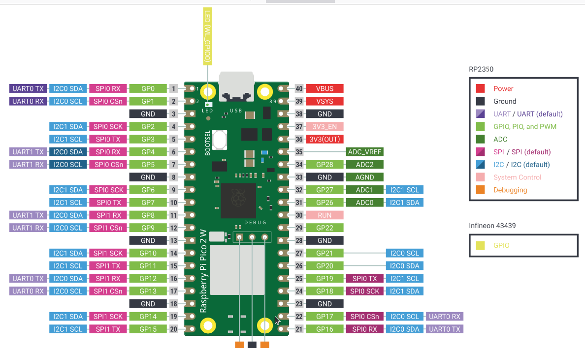

### Pin Modes

If you look at the Pico pin-out diagram, you will see that a GPIO pin may be 
configured to operate in one of several operational modes. 



No matter the mode, when using Telemetrix, you must first explicitly set the mode 
by calling one of the _set_pin_mode_XXX_ methods for the pin. For output modes, if you try 
to perform a _write_ operation and have not first set the pin's mode, a RunTimeError 
exception is thrown.

### Valid GPIO Pin Numbers

GPIO Pins 0 through 22, and 26 through 28 are valid pins to use.
The board LED is GPIO pin 64.

### ADC Pins
ADC pins are specified by their corresponding ADC number, 
not their GPIO pin number.

ADC numbers are mapped as follows:

               ADC0 = GPIO 26 (Physical Pin 31)
               ADC1 = GPIO 27 (Physical Pin 32)
               ADC2 = GPIO 28 (Physical Pin 34)

               Internal Mapping
               ADC3 = GPIO 29 (Physical Pin 35) ADC Reference Voltage
               ADC4 = GPIO 30 (No Physical pin - mapped internally)
                              CPU temperature\

### I2C Pins
Telemetrix supports two i2c ports, 0 and 1. SDA and SCL 
are mapped to GPIO pins as follows:

#### SDA Pins
  * Port 0 = 4
  * Port 1 = 26 
  
#### SCL Pins
  * Port 0 = 5
  * Port 1 = 27

### SPI Pins
Telemetrix supports two SPI ports, 0 and 1. 
Pins are mapped as follows:

  * Chip Select(**CS**) may be any valid GPIO pin number.
  * **MISO**: SPI data receive pin
    * spi0 = 16 
    * spi1 = 12

  * **MOSI**: SPI data transmit pin
    * spi0 = 19
    * spi1 = 15

  * Clock Pin (**CLK**): 
    * spi0 = 18 
    * spi1 = 14

### Device Number Limits
* Stepper motors: **4**
* DHT Temperature/Humidity Sensors: **2**
* HC-SR04 Sonar Distance Sensors: **4**


### Callbacks

When you set a pin to an input mode, you must register a callback function to 
notify the application of any changes to the pin's data.

**Telemetrix does not support polling or direct read 
methods for inputs. Instead, as soon as a data change is detected, 
the pin's associated callback is called, allowing for immediate response 
to data changes and, in general, simpler application design.**

When you create a callback function, you must specify a single 
input parameter. The client automatically populates this parameter 
with a list describing the data change.

The callback data list's contents vary by input pin type and are described in detail 
for each set_pin_mode_XXX method in the API documentation.

#### Callback Data Format
The first element in the list identifies the report type, and the last element 
is the 
timestamp of the data change. Other elements identify the GPIO pin, the 
current data value, and any other relevant information.


#### Report Types

|                  Report Type                  | Report Type Value |
|:---------------------------------------------:|:-----------------:|
| Digital Input (including pullup and pulldown) |         2         |
|              Analog Input (ADC)               |         3         |
|                   i2c Read                    |        10         |
|                SONAR Distance                 |        11         |
|                      DHT                      |        12         |
|                   SPI Read                    |        13         |
|            STEPPER_DISTANCE_TO_GO             |        15         |
|            STEPPER_TARGET_POSITION            |        16         |
|           STEPPER_CURRENT_POSITION            |        17         |
|            STEPPER_RUNNING_REPORT             |        18         |
|          STEPPER_RUN_COMPLETE_REPORT          |        19         |
|                CPU_TEMP_REPORT                |        20         |
|               UNIQUE_ID_REPORT                |        62         |


#### Converting The Raw Timestamp

To convert the raw timestamp field to a human-readable time, use **time.localtime()**.

### Registering A Callback
The line below establishes GPIO pin 12 as a digital input pin with pullups 
enabled and
associates a user-provided function, named **_the_callback,_** to be called whenever 
the state of pin 12 changes.

```python
board.set_pin_mode_digital_input_pullup(12, the_callback)
```

### A Callback Function Example

Here is the implementation for the callback function that services pin 12. 
It prints out a notification of the change to the console. Your callback function 
may store the latest value or issue a command, such as to control an LED 
or another device.

**NOTE:** Keep the callback function as short as 
possible. If you need to perform extended processing, 
create a separate thread or task so your application can continue
without blocking.

```python

def the_callback(data):
    """
    A callback function to report data changes.
    This will print the pin number, its reported value and
    the date and time when the change occurred

    :param data: [pin mode, pin, current reported value, pin_mode, timestamp]
    """
    date = time.strftime('%Y-%m-%d %H:%M:%S', time.localtime(data[CB_TIME]))
    print(f'Report Type: {data[CB_PIN_MODE]} Pin: {data[CB_PIN]} '
          f'Value: {data[CB_VALUE]} Time Stamp: {date}')

```

And here is the output printed by the callback function:
```python
Report Type: 2 Pin: 12 Value: 1 Time Stamp: 2021-03-15 16:41:08
```
