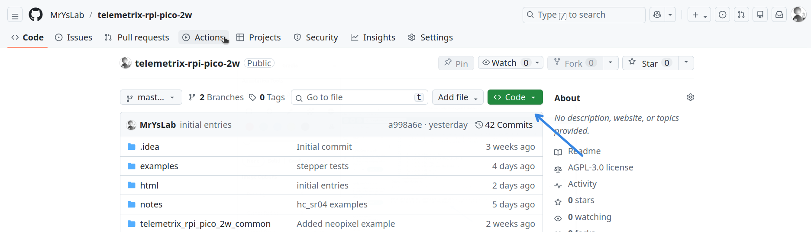

# Application Creation

## The Pico W2 PID and VID
Each Pico device has a product ID (PID) and a vendor ID (VID) burned 
into the device. When your application starts, these values are used to 
verify that it is connecting to the correct type of board.
For the Pico 2W, it is assumed that the PID = 61455 and the VID = 11914.

For the Pico 2W, it is assumed that the PID = 61455 and the VID = 11914.

If your application fails to connect to the Pico, please check the PID 
and VID values being returned from the device.

To do so, execute the following command:

**python -m tools.list_ports**

This command lists all the possible comports and device information.

For the Pico, you may see something that looks like this:

**Description: Pico 2W - Pico Serial  Device:/dev/ttyACM0  pid=61455  vid=11914**

If the PID and VID do not match the values above, you may set them using the pid 
and vid parameters when instantiating the API class for the first time.


## A Quick Start To Developing Applications

### Examples
Examples are provided for each API and are a good source for understanding how 
applications are implemented using Telemetrix.

* [BLE Threaded](https://github.com/MrYsLab/telemetrix-rpi-pico-2w/tree/master/examples/BLE/threaded){: target="_blank" rel="noopener"}

* [Serial Threaded](https://github.com/MrYsLab/telemetrix-rpi-pico-2w/tree/master/examples/Serial/threaded){: target="_blank" rel="noopener"}

* [WiFi Threaded](https://github.com/MrYsLab/telemetrix-rpi-pico-2w/tree/master/examples/WIFI/threaded){: target="_blank" rel="noopener"}

* [BLE Asyncio](https://github.com/MrYsLab/telemetrix-rpi-pico-2w/tree/master/examples/BLE/asyncio){: target="_blank" rel="noopener"}

* [Serial Asyncio](https://github.com/MrYsLab/telemetrix-rpi-pico-2w/tree/master/examples/Serial/asyncio){: target="_blank" rel="noopener"}

* [WiFi Asyncio](https://github.com/MrYsLab/telemetrix-rpi-pico-2w/tree/master/examples/WIFI/asyncio){: target="_blank" rel="noopener"}

## Downloading And Running The Examples

Go to the [telemetrix-rpi-pico-2w](https://github.com/MrYsLab/telemetrix-rpi-pico-2w){: target="_blank" rel="noopener"}
GitHub repository. Click the green button 
in the upper-right corner and download the ZIP file.



Next, expand the ZIP file and open the examples directory. 
Select any of the examples that you wish to run.

## Application Templates
Below are application templates to help you get started.
The templates show how to instantiate each API. For asyncio, the templates

### BLE Threaded

Import the API and instantiate its class.

```angular2html
import sys
import time

# IMPORT THE API
from telemetrix_rpi_pico_2w_serial import telemetrix_rpi_pico_2w_ble
"""

# INSTANTIATE THE API CLASS
board = telemetrix_rpi_pico_2w_serial.TelemetrixRpiPico2wBle()

try:
    # WRITE YOUR APPLICATION HERE
except:
    board.shutdown()

```

### Serial Threaded

Import the API and instantiate its class.

```angular2html
import sys
import time

# IMPORT THE API
from telemetrix_rpi_pico_2w_serial import telemetrix_rpi_pico_2w_serial
"""

# INSTANTIATE THE API CLASS
board = telemetrix_rpi_pico_2w_serial.TelemetrixRpiPico2wSerial()

try:
    # WRITE YOUR APPLICATION HERE
except:
    board.shutdown()

```

### WiFi Threaded
Here, we need to instantiate the class passing in the IP address assigned by your 
router. This parameter enables the WIFI transport.

```angular2html
import sys
import time

# IMPORT THE API
from telemetrix_rpi_pico_2w_wifi import telemetrix_rpi_pico_2w_wifi

# INSTANTIATE THE API CLASS
# Make sure to edit the transport address assigned by your router.

board = telemetrix_rpi_pico_2w_wifi.TelemetrixRpiPico2WiFi(ip_address='192.168.2.212')

try:
    # WRITE YOUR APPLICATION HERE
except:
    board.shutdown()

```

### BLE Asyncio

For asyncio, in addition to importing the API, we implement the application
in an asyncio function.

After obtaining an asyncio loop, we instantiate the API, passing in the loop.

We run the application by calling loop.run_until_complete(my_app(board)) 
and then gracefully shut it down.

```angular2html

import sys
import asyncio

# IMPORT THE API
from telemetrix_rpi_pico_2w_serial_aio import telemetrix_rpi_pico_2w_ble_aio

# An async method for running your application.
# We pass in the instance of the API created below .
async def my_app(the_board):
    # Your Application code

# get the event loop
loop = asyncio.new_event_loop()
asyncio.set_event_loop(loop)

try:
    board = telemetrix_rpi_pico_2w_serial_aio.TelemetrixRpiPico2WBleAIO(loop=loop)
except KeyboardInterrupt:
    sys.exit()

try:
    # start the main function
    loop.run_until_complete(my_app(board))
except KeyboardInterrupt:
    try:
        loop.run_until_complete(board.shutdown())
    except:
        pass
    sys.exit(0)

```

### Serial Asyncio

For asyncio, in addition to importing the API, we implement the application
in an asyncio function.

After obtaining an asyncio loop, we instantiate the API, passing in the loop.

We run the application by calling loop.run_until_complete(my_app(board)) 
and then gracefully shut it down.

```angular2html

import sys
import asyncio

# IMPORT THE API
from telemetrix_rpi_pico_2w_serial_aio import telemetrix_rpi_pico_2w_serial_aio

# An async method for running your application.
# We pass in the instance of the API created below .
async def my_app(the_board):
    # Your Application code

# get the event loop
loop = asyncio.new_event_loop()
asyncio.set_event_loop(loop)

try:
    board = telemetrix_rpi_pico_2w_serial_aio.TelemetrixRpiPico2WSerialAIO(loop=loop)
except KeyboardInterrupt:
    sys.exit()

try:
    # start the main function
    loop.run_until_complete(my_app(board))
except KeyboardInterrupt:
    try:
        loop.run_until_complete(board.shutdown())
    except:
        pass
    sys.exit(0)

```


### WiFi Asyncio

For asyncio, in addition to importing the API, we implement the application
in an asyncio function.

After obtaining an asyncio loop, we instantiate the API, 
passing in the loop we received and the IP address assigned by our router.

We run the application by 
calling loop.run_until_complete(my_app(board)) and then gracefully shut it down.

```angular2html

import sys
import asyncio

# IMPORT THE API
from telemetrix_rpi_pico_2w_wifi_aio import telemetrix_rpi_pico_2w_wifi_aio

# An async method for running your application.
# We pass in the instance of the API created below .
async def my_app(the_board):
    # Your Application code

# get the event loop
loop = asyncio.new_event_loop()
asyncio.set_event_loop(loop)

# instantiate telemetrix_aio
# Make sure to edit the transport address assigned by your router.
board = telemetrix_rpi_pico_2w_wifi_aio.TelemetrixRpiPico2WiFiAio(
    ip_address='192.168.2.212', loop=loop)

try:
    # start the main function
    loop.run_until_complete(my_app(board))
except KeyboardInterrupt:
    try:
        loop.run_until_complete(board.shutdown())
    except:
        pass
    sys.exit(0)

```


