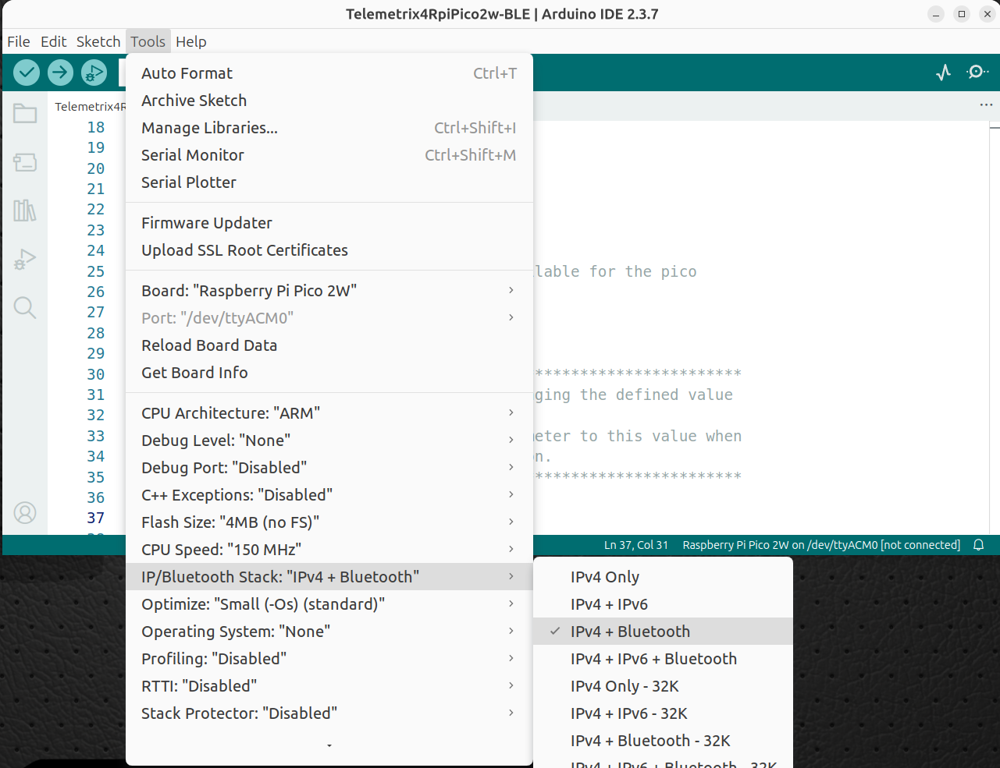

# Server Configuration

## Telemetrix4RpiPico2w-BLE

### BLE Default Advertising String
Both BLE server's use the default advertising string of "**Tmx4Pico2W**". 
It is defined near the top of the sketch for both BLE servers.

To modify the advertising string, search the server sketch for:

```aiignore
#define PICO2W_ID "TmxPico2W"
```

Place the new string between the quotation marks.


!!! warning

    If you change the advertising string on the server, you must inform
    the BLE client of the new string.
    The client is made aware of the new string, by using the ble_device_name
    parameter when instantiating the client class.
    

### Setting The Advertising String In The Telemetrix4RpiPico2w-BLE Class

**TelemetrixRpiPico2Ble**
```aiignore
class TelemetrixRpiPico2Ble (ble_device_name='Tmx4Pico2W',
                             sleep_tune=1e-06,
                             autostart=True,
                             shutdown_on_exception=True,
                             reset_on_shutdown=True) 
```


### Setting The Advertising String In The TelemetrixRpiPico2wBleAio Class
```aiignore
class TelemetrixRpiPico2wBleAio (ble_device_name='Tmx4Pico2W',
                                 sleep_tune=1e-06,
                                 autostart=True,
                                 loop=None,
                                 shutdown_on_exception=True,
                                 reset_on_shutdown=True,
                                 close_loop_on_shutdown=True) 
```
<br>

### Enable The Bluetooth Stack Before Compiling The BLE Server 


Before compiling a BLE server, you must configure the Arduino IDE 
to include the
BLE stack. To do so, in the Arduion IDE, select **Tools/IP/Bluetooth Stack** 
and then **IPV4 + Bluetooth**.

<br>


<br>


## Telemetrix4RpiPico2w-Serial

The serial server requires no configuration.

## Telemetrix4RpiPico2w-WiFi


#### Required Configuration

##### SSID
Edit the sketch and place your router's SSID between the quotes.

##### PASSWORD

Edit the sketch and place your router's PASSWORD between the quotes.

Save your changes.

## Upload The Server To The Pico

Select the board and port on the Arduino IDE.


Next, plug your Pico into a USB port and upload the server by pressing the upload
button on the Arduino IDE.


## Startup Information Sent To The Arduino IDE Serial Monitor At Server Power Up
If you enable the Arduino IDE's serial monitor, when you first power the
Pico2w, you will see information strings appear for each server type.

### BLE Server

```aiignore
180f
6e400001-b5a3-f393-e0a9-e50e24dcca9e
Telemetrix4RpiPico2w-BLE  Version 1.0.0
Copyright (c) 2026 Alan Yorinks All rights reserved.
Device MAC Address: 2C:CF:67:DF:E8:EE
```
The first two lines are BLE service UUIDS. They are generated by the arduino-pico 
library. 

The Pico2w will blink the board LED twice and is ready to connect to the Python client.


The MAC address of the Raspberry Pi Pico2w is displayed for information purposes.

### Serial Server

```aiignore
Telemetrix4RpiPico2w-Serial  Version 1.1.0
Copyright (c) 2025-2026 Alan Yorinks All rights reserved.
Ready
```
The server should be ready for use when you see "Ready" appear.

### WiFi Server
```aiignore
Telemetrix4RpiPico2w-WIFI  Version 1.1.0
Copyright (c) 2022-2026 Alan Yorinks All rights reserved.
Remember to set the SSID and PASSWORD in the sketch


Allow 15 seconds for connection to complete................
Connected to WiFi. IP Address: 192.168.2.212  IP Port: 31335
```
You must set the SSID and Password to match that of your router. There is
a reminder displayed for you to do that.

It may take several seconds for the Pico2w to connect to your router. A connection 
progress string is displayed. When you first power the Pico2w, the board LED is lit 
and stays on until there is a successful connection with your router.
The IP address assigned to the Pico2w by the router is displayed and the IP port 
number as well.

