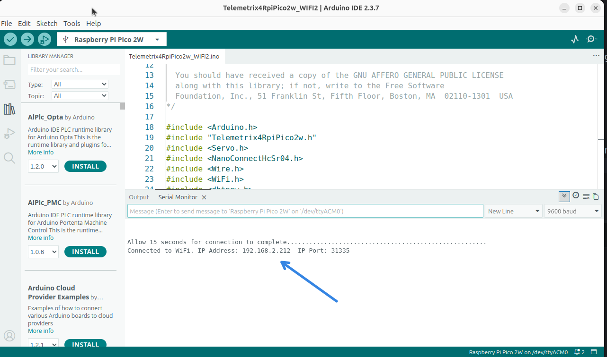

## Server Configuration

### Telemetrix4RpiPico2w-Serial

The serial server requires no configuration.

### Telemetrix4RpiPico2w-WiFi

#### Required Configuration

##### SSID
Edit the sketch and place your router's SSID between the quotes.

##### PASSWORD

Edit the sketch and place your router's PASSWORD between the quotes.

Save your changes.

## Upload The Server To The Pico

Select the board and port on the Arduino IDE.

Next, plug your Pico into a USB port and upload the server by pressing the upload
button on the Arduino IDE.

## Getting The Assigned Router IP Address
If you selected the WiFi server, open the Arduino IDE's serial monitor by
clicking the serial monitor button.

Repower the Pico, and the router's assigned IP address will 
appear in the Arduino IDE's serial monitor window.

