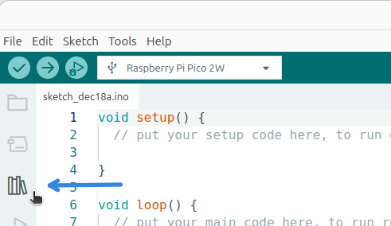
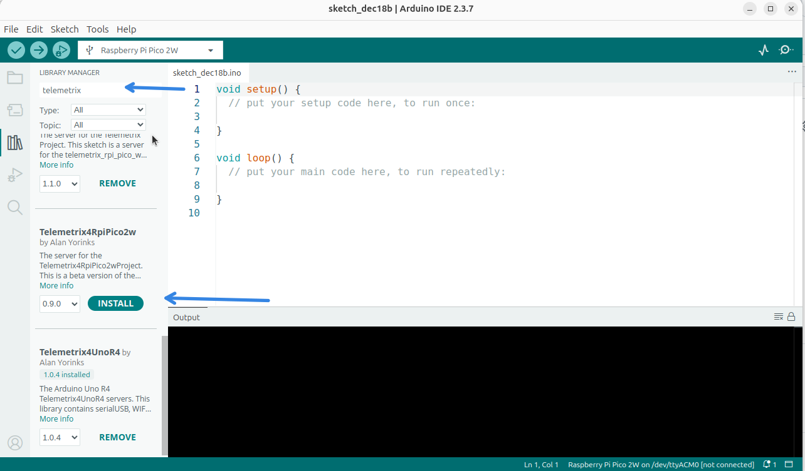

1. Open the Arduino IDE, then click the library icon.

    

1. In the search box, type telemetrix. Then scroll down until you locate the 
Telemetrix4RPiPico2W library, and then click INSTALL.

    

1. You will be prompted to install all of the dependencies. Select INSTALL ALL.

    

